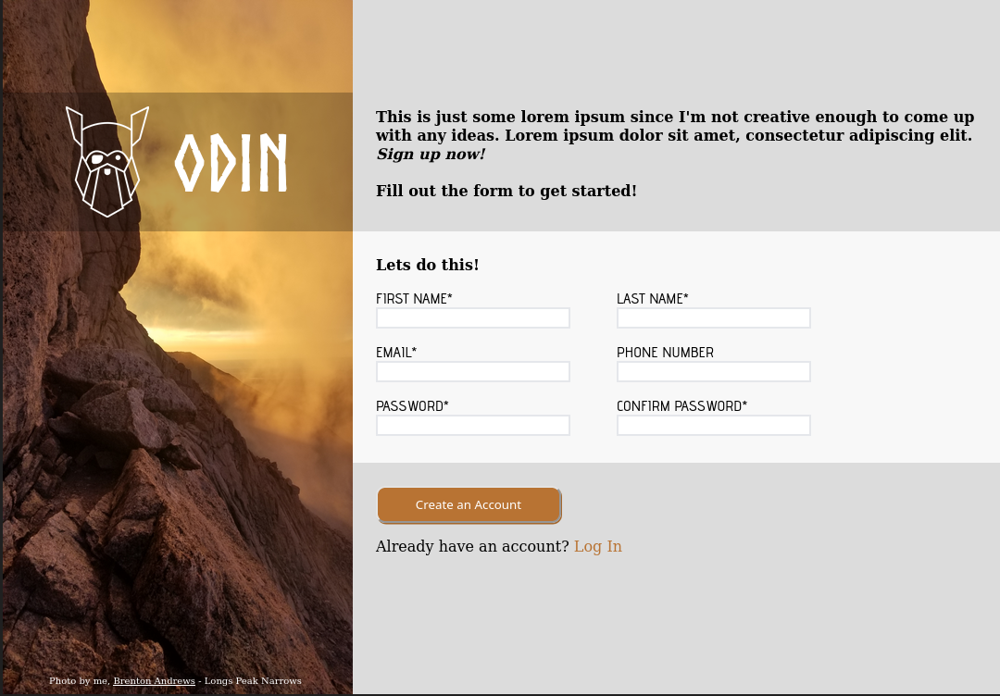

# Sign Up Form

View the entire project [here](https://brenton-j-andrews.github.io/odin_form/). 

---

#### About this project

Completed for [The Odin Project](https://www.theodinproject.com/lessons/node-path-intermediate-html-and-css-sign-up-form) Intermediate HTML / CSS course.

This project served as a introduction to HTML form layout and form validation. 

Not much else to say, but if you like hiking I highly recommend Longs Peak. Did it in October 2021 and it was fantastic but a bit challenging. [The details](https://connect.garmin.com/modern/activity/7620133809).
